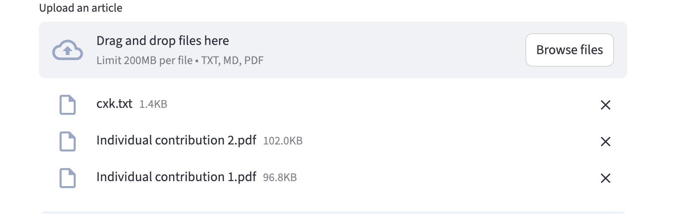
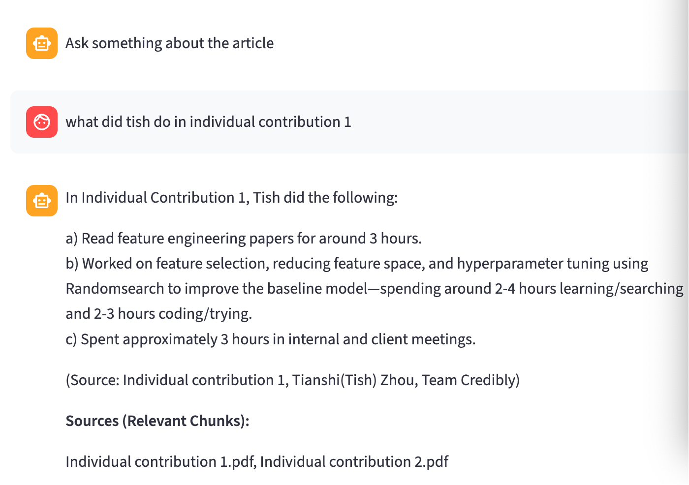

### Instruction to run
1. To run the code
   ```bash
   API_KEY="your_actual_API_KEY" streamlit run your-file-name.py
   ```
2. Drag file to the box, It will give you a sign of successfully uploaded and  return different erros if exists, for example(not supported type, empty, or not readable)
3. Type anything about the file, it will only answer your question if LLM can find it in documents, if not it will say "don't know"

### Features:
1. Support both pdf and txt files
2. Also supported multiple files at a time

3. It will show where is the source comes from in text and list the source name below.

4. It answers only based on files, will reply "don't know" if answers are not in files.
